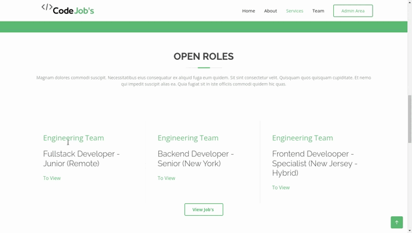

# Code Job's

Uma empresa precisou de uma solução para as candidaturas em sua empresa. Pensado em uma solução onde os candidatos pudessem se candidatar para as vagas de maneira simples, foi criado o sistema Code Job's. Um site simples que além de contar com as informações da empresa, conta com o sistema de vagas onde o candidato só precisa achar a vaga que se encaixa e enviar o seu curriculo.

## Imagens do projeto

## 🛠️ Construído com

O Code Job's utiliza as seguintes tecnologias:

* Node.js
* ExpressJS
* Ejs
* Sqlite

---
⌨️ com ❤️ por [Michael Wellington Lopes](https://github.com/michaelwell23) 😊